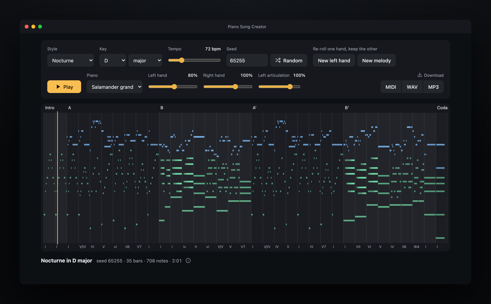

# Piano Song Creator

**[Play it in your browser on itch.io](https://stmn.itch.io/piano-song-creator)**

A piano song generator that writes a whole classical piano piece from a single number, entirely in
the browser. No trained model and no corpus of existing music: form, harmony and melodic contour come
from rules, everything else from a seeded random generator. The style sets meter, tempo, accompaniment
preferences and a bias on the melodic character. Export as MIDI, WAV or MP3.

The same seed always writes the same piece.

## What it does badly

This is a rule-based generator, not a composer. Worth knowing before you decide what it is for:

- **Nothing it writes is memorable.** A piece is coherent, it goes somewhere and it ends properly,
  but it has no idea worth humming. That is the part rules cannot do.
- **The harmony is a textbook.** Diatonic chords, a few secondary dominants, at most one modulation
  and only to the relative key. Nothing surprising ever happens harmonically.
- **Phrases are always four bars.** Every piece breathes in the same regular squares: no irregular
  phrase, no elision, no interruption.
- **Style names describe a surface, not an idiom.** A Chorale here is a slow melody over block
  chords, not four-part Bach harmony. Blues is the one style whose defining features are actually
  implemented.
- **Some seeds are dull.** It is a lottery with good odds, not a guarantee.
- **One velocity layer.** Soft and loud notes differ in level but not in timbre, because the piano is
  a sampler, not a physical model.
- **The pedal is simulated per chord change,** not decided by ear, so busy passages can blur.
- **It needs the internet on first load** to fetch the piano samples.

If you want background music you can generate forever, or raw MIDI to take into a DAW, it does that
well. If you want a piece that sounds composed by a person, it does not.

## Run locally

    ./start.sh          # serves http://localhost:8765 and opens the browser

ES modules do not load from `file://`, hence the server. Sound: Salamander piano samples via Tone.js
(internet needed on first load). Every change of a setting generates a new piece; click the piano roll
to move the playhead (Space plays and stops); the left and right hand have separate volume sliders, and
"Left articulation" scales the left-hand note lengths (staccato below 100%, more pedal above), live and
in every export.
Twelve voices: the Salamander grand (Tone.js), eight General MIDI soundfont instruments from the
midi-js-soundfonts collection (concert, bright, warm and soft grands, electric grand, honky-tonk,
electric piano, harpsichord), and three chiptune voices (4-bit, 8-bit, 16-bit) played by oscillators
rather than samples, dry and without a pedal, because that is what those machines were. All loaded on
demand and levelled to the same loudness. Download as MIDI, WAV or MP3 (audio is rendered offline in the browser with the same piano and reverb;
MP3 via lamejs).

## Styles

Nocturne, Prelude, Ballade, Sonatina, March, Chorale, Elegy, Etude (4/4); Waltz, Minuet, Mazurka,
Polonaise (3/4); Barcarolle, Lullaby, Tarantella (6/8); Blues (12-bar form, seventh chords, blues scale,
shuffle, boogie or walking bass).

The style names describe the surface the generator reproduces (meter, tempo, accompaniment texture,
a bias on the melody), not the full historical idiom. A "Chorale" here is a slow melody over block
chords, not four-part Bach harmony.

## Re-rolling one hand

Three random streams feed a piece: the main seed decides form and harmony, a melody seed the right
hand and a left-hand seed the accompaniment. "New left hand" and "New melody" re-roll one stream and
keep the other: a new left hand leaves the melody identical note for note, a new melody keeps the
left-hand figuration (which only adapts its density to the new melody). Programmatically:
`generatePiece({ seed, melodySeed, leftSeed })`.

## What makes it sound played rather than sequenced

Both hands draw their pitches from the same chord at every moment, so they never clash harmonically;
their textures are drawn independently. On top of that:

- **Harmony.** Chord names carry figured-bass suffixes (`I64`, `ii6`, `V65`, `V43`), so cadential
  six-four chords and inversions are written rather than stumbled into; the bass takes the root unless
  the figure asks otherwise. The melody sings the scale of the chord it is over, which is harmonic
  minor over a dominant and the applied scale over a secondary dominant, instead of clashing a
  semitone against it. A phrase ends on the chord tone that steps into the next phrase's first note.
- **Melody.** A note outside the chord is approached and left by step, so it is a passing or
  neighbour note instead of a wrong note. One rhythmic motif, its variant and a contrasting bar are
  drawn per piece and laid out as a-a'-b-cadence, and when the motif's rhythm returns its shape
  returns with it, transposed inside the key: a sequence. Cadences are planned backwards from the
  goal note through the note that steps into it. Each eight-bar period has one climax; every other bar
  stays below it. Phrases may start with an upbeat, taken out of the previous note's length.
- **Left hand.** Chord tones never sound below C3 and nothing closer than a fourth sounds down there.
  The accompaniment stays under the melody's top voice, thins under a busy melody and answers a
  sparse one, and follows the phrase dynamics. It never strikes the identical set of pitches more
  than twice in a row, never alternates two strikes for more than two cycles, and never strikes one
  pitch more than four times in a row at eighth-note spacing or faster; a voice rests rather than
  hammer on.
- **Form.** The last A is a varied reprise: decorated melody, a different consequent, a fuller
  accompaniment and the loudest level in the piece. C is a third idea, not a second B: the other key,
  the opposite contour, a different figuration. A piece that ends in its contrast section closes with
  an authentic cadence there. The coda echoes the cadence it just sang, over the chords it was
  composed on, softer. The last chord is struck once, rolled from the bottom, and rings for a few
  seconds instead of being stretched into a drone.
- **Dynamics.** Each style has its own level and range; the phrase swell is built around where the
  melody actually peaks, shaded by the contour, and drifts slowly rather than jittering per note.
  Grace and trill notes are softer than the notes they decorate.
- **Articulation.** Note lengths follow context: legato inside a step, a lift on a repeated note, a
  breath after a leap, a real gap at phrase ends, staccato on the strong beats of a march.
- **Timing.** The time map is a tempo curve, not a metronome: phrases lean forward and broaden into
  their cadences, sections settle as they begin, the last bars slow down. A performance layer adds
  the melody lead over the bass, per-strike micro-timing, spread chords and a swing that is not an
  exact triplet. All of it applies to the audio and the MIDI only; the piano roll and the editor stay
  on the written grid.
- **Sound.** The pedal holds the accompaniment until the harmony changes, lifting just before it, so
  broken chords ring instead of sounding like a music box. Release length follows the note: a finger
  lift, a staccato, or the pedal still down. Velocity maps to gain through a curve, so the same
  spread covers a real dynamic range.

## Tests

    node --test

## Files

- `composer.js` - the composer (pure module, no dependencies)
- `midi.js` - Standard MIDI File writer (handles 6/8)
- `app.js`, `index.html` - interface, playback, piano roll
- `composer.test.mjs` - musical invariants over many seeds and a diversity check
- `docs/` - the screenshot used above
- `tools/build-itch.sh` - packs the four runtime files into `dist/`, as the zip itch.io expects

## Credits

Piano samples: the Salamander grand hosted by Tone.js and General MIDI soundfonts from
[midi-js-soundfonts](https://github.com/gleitz/midi-js-soundfonts). MP3 encoding: lamejs.
Icons: [Lucide](https://lucide.dev) (ISC licence), inlined in `index.html` and `app.js`.

## Licence

The code is MIT. Music the tool writes for you is yours; nothing in the generator is derived from
anyone else's music.
